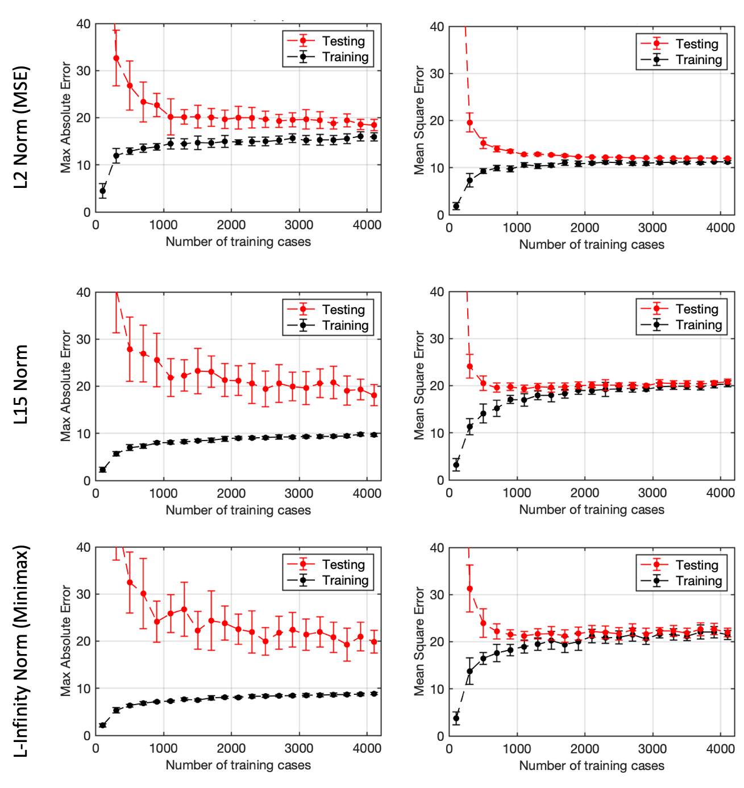

# Effects of L-Norm loss fuctions on Virtual IMRT QA

   The purpose of this work is to compare the models resulting from using the mean squared error or the maximum possible error (max-error)  as a loss function. Our hypothesis was that reducing the mean error over the population, as done when using low-order norms, may not be appropriate because we might incur big errors for specific plans. Reducing the maximum possible error (max-error), as done when using Chebyshev Minimax or high-order norms, may help ensure that all plans are still predicted within a boundary at the cost of a increased mean error over the whole population.

<h1>In-sample performance of L2 and L-infinity (Minimax)</h1>

   Predicted and actual (measured) passing rate for OLS (top-left) and Minimax (top-right) models. Solid line is the perfect agreement line and +/-3% are dashed lines, showing that no plans pass this threshold with the MM model.

  
  

<h1>Prediction errors for various L-Norm loss functions</h1>

   Prediction error histograms from models using variou normalizations (L1 - L100). A larger number of predictions have zero error with low order Norms (L1 and L2), however, a narrower spread were found with higher order Norms (>L15) indicating a lower max error and fewer outliers.

<table border="0px">
   <tr>
      <td width="400"></td>
      <td></td>
   </tr>
</table>

<!--
 
-->

<h1>Out-of-sample performance</h1>

   Mean-squared error and max-error are shown on the training dataset for models of different normalization (left) and their out-of-sample performance using the leave-one-out method (right). The training results show that normalization as low as L15 give similar results as Minimax

   
   

<h1>Bias-Variance Analysis</h1>

   Learning curves showing max absolute error for LSE (left) and Minimax (right) for training (black) and testing (red). For each dataset size, 100 training sets were generated to fit LSE and MM models that were tested on the same 50 testing cases. Mean value and standard deviation for the 100 training sets is plotted

<h1>Key Findings</h1>
